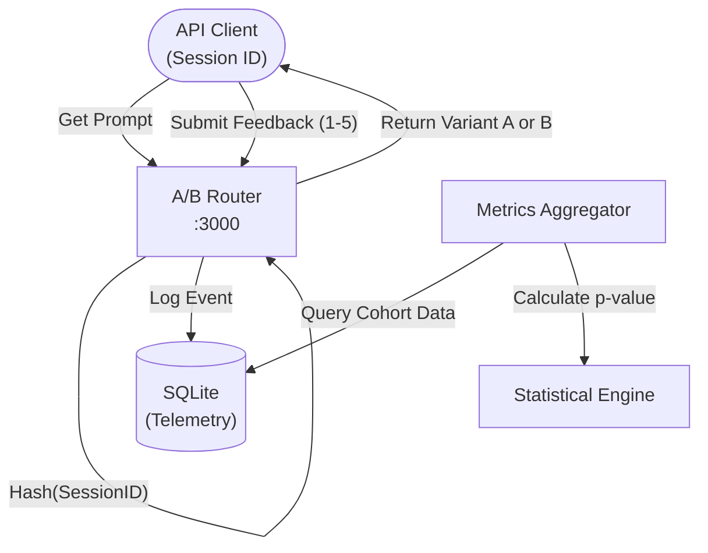

# Architecture — prompt-ab-testing-platform
> Last updated: 2026-08-29 | Maturity: Partial Prototype
> _A/B testing platform for prompt variants with statistical rigor._

## System Diagram

## Component Table
| Component | File | Responsibility | Tech |
|---|---|---|---|
| Router | `src/router.ts` | Assigns cohorts deterministically | Node.js |
| Stats Engine | `src/stats.ts` | Calculates Z-score / T-test | Node.js |
| Storage | `src/db.ts` | Logs assignment and feedback events | SQLite |

## Dependency Honesty Table
| Dependency | Status | Notes |
|---|---|---|
| SQLite | **Real** | Used as a local data warehouse for telemetry. |
| LLM Provider | **Mocked** | Platform assumes prompt injection happens downstream. |

## Component Breakdown
- **Core Technology**: TypeScript, PostgreSQL, SciPy (via Python worker)
- **Design Paradigm**: Emphasizes high availability, fault tolerance, and security.