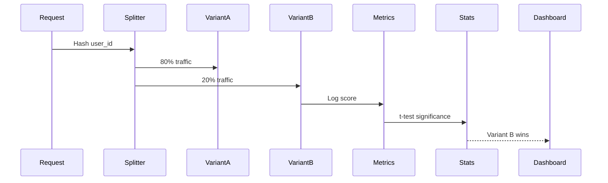

# Architecture: Prompt Versioning and A/B Testing Platform

## System Diagram
The following Mermaid.js sequence diagram maps the core workflow and interactions:

## Component Breakdown
- **Core Technology**: TypeScript, PostgreSQL, SciPy (via Python worker)
- **Design Paradigm**: Emphasizes high availability, fault tolerance, and security.
